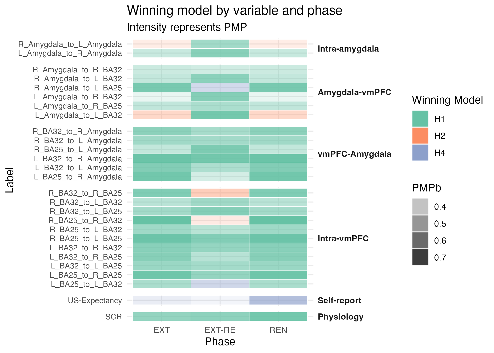
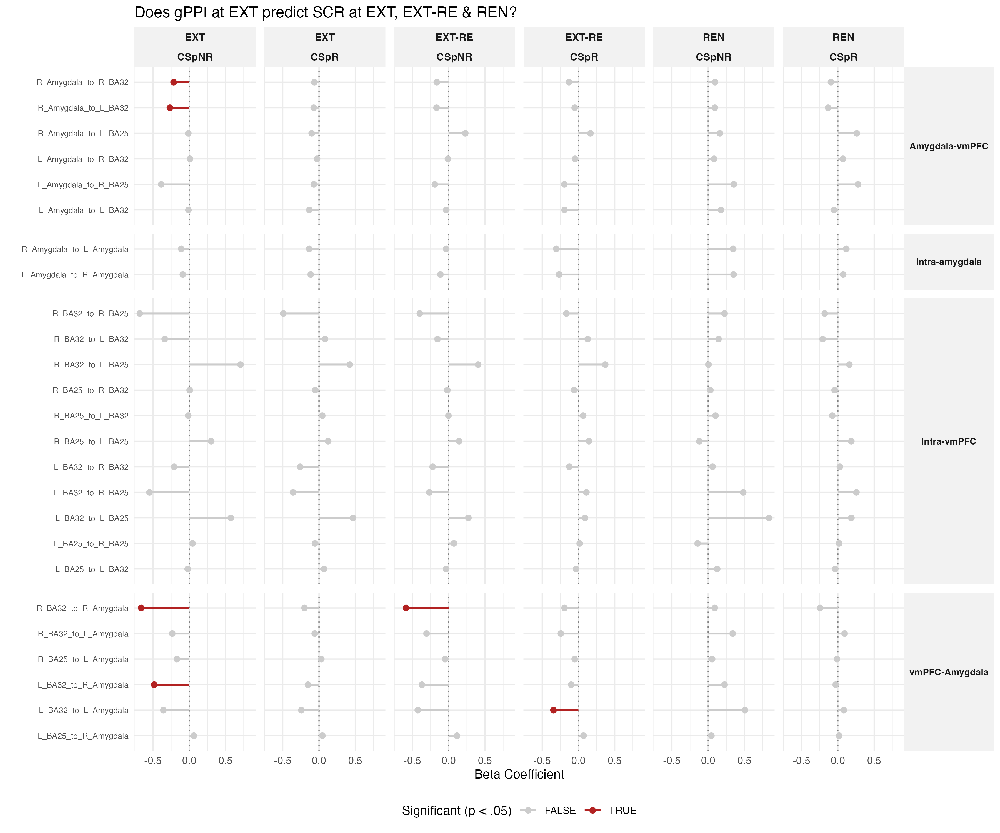

# Behavioral Memory Updating: Does reactivation prevent return-of-fear following extinction?
**Project ID: ReactExtMRI**

[](https://osf.io/kj7nr)
[](https://osf.io/kj7nr)

GitHub Author: Emma Biggs

Project Corresponding Author: Tom Beckers (tom.beckers@kuleuven.be)

## Introduction

The disruption of emotional memory reconsolidation may have clinical application in the improvement of treatments for anxiety disorders. Previous research has found that reactivating a fear memory can enhance the effect of subsequent extinction learning and thus reduce the later return-of-fear, although inconsistent findings have raised questions about the boundary conditions of this effect. It has been proposed that reactivation-extinction procedures result in an updating of a labile memory, while extinction training without reactivation results in the creation of a competing memory trace. Recent advancements in neuroimaging methods now allow the posited neural mechanisms of (reactivation-)extinction to be tested.

## Data collection & preprocessing
*Further study details at OSF [[link](https://osf.io/kj7nr)]*

### Participants
30 healthy adults participated
- 1 excluded due to incomplete data collection
- Final analysis N=29

### Procedure
2-day fear conditioning protocol
- Day 1: Acquisition (ACQ)
- Day 2: Reactivation (REACT), Extinction (EXT), Extinction Recall (EXT-RE), Renewal (REN)

*Experiment files (PsychoPy) available in /experiment*

### Measures
MRI (3T Siemens), skin conductance, and self-reported US-expectancy were collected throughout the protocol.

**Preprocessing:**
- SCR was quantified using Ledalab decomposition, z-scored per participant based on responses during ACQ.
- MRI data was preprocessed using fMRIprep and then a generalized psychophysiological interaction (gPPI) analysis in CONN.

*Raw (individual-level) data available upon request from the author*

## Analysis preparation

The analysis preparation pipeline includes the following steps:

- **ID Alignment:** Mapping numeric codes to participant IDs.
- **Outlier Detection:** Automated removal of values exceeding 4 SD from the group mean, calculated per phase and CS type.
- **Differential Scoring:** Calculation of CS- adjusted responses for SCR and gPPI.
- **Data Tidying:** Transformations to facilitate statistical modeling.

## Analysis

The analysis is divided into two primary research questions:

**RQ1:** *Are there differences between the reactivated versus non-reactivated CS+?*

- Method: Using the bain package, we evaluate informative hypotheses
- Inference: Posterior Model Probabilities (PMPs) and Bayes Factors (BFs) are used to determine evidence for the experimental hypotheses vs. the null.
- Visualization: A heatmap is produced showing the winning model over the variables tested.




**RQ2:** *Do changes in effective connectivity relate to changes in SCR and US-expectancy?*

 - Method: Linear mixed effects models (SCR ~ CS Type * Phase * gPPI (1|pID)).
 - Inference: Sattherwaite corrected p-values.
 - Visualization: Results are summarized using Forest Plots categorized by anatomical circuits.




## The github repo:

### Layout

```text
├── data/
│   ├── raw/          # Original (study-level) SCR, Ratings, and gPPI CSVs
│   └── processed/    # Cleaned master_data.csv
├── experiment/		  # Psychopy scripts used for data collection
├── notebooks/
│   └── Analysis.Rmd  # Analysis pipeline
├── output/
│   ├── figures/      # Forest plots, Heatmaps
│   └── tables/       # Statistic summary tables
├── src/			  # Matlab scripts for generating study-level .csv datafiles from individual-level files
└── README.md
```

### Requirements & Quick Start

This project was developed using **R version 4.3.0.**

To replicate the analysis, you will need the following R packages installed:

- Data Structuring: tidyverse, stringr, forcats, broom
- Bayesian Statistics: bain (Note: ensures compatibility with JASP outputs)
- Marginal Effects: emmeans
- Reporting & Visualization: DT, kableExtra, tidytext, RColorBrewer

You can install all **dependencies** at once by running:

`install.packages(c("tidyverse", "bain", "emmeans", "broom", "DT", "kableExtra", "tidytext", "RColorBrewer"))`

To **Quick Start** this project:

1) Clone the repository:

	`git clone https://github.com/emma-biggs/ReactExtMRI.git`

2) Open the .Rproj file in RStudio to ensure the working directory is set correctly to the project root.

3) Check the raw data files (Ratings, SCR, and gPPI) are located in the data/raw folder

4) Run the notebooks/Analysis.Rmd file, use Knit to create the .html output file.


