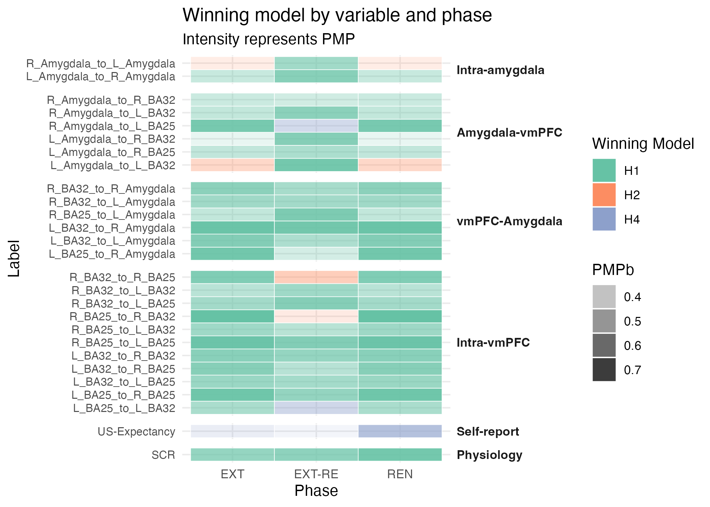

# Multi-Modal Analysis Pipeline

## Does 'reminding' the brain of a memory before treatment actually make the treatment more effective?&#x20;

We tested this by pitting 'Reactivated CS+' against 'Non-Reactivated CS+' in a Bayesian Informative Hypothesis framework (`bain`). This allowed us to move beyond the limitations of traditional null-hypothesis testing, employing the `bain` framework to evaluate informative hypotheses. This allowed us to simultaneously test multiple experimental theories against the null.

### Decision tool

Analysis results are synthesized into a winning-model heatmap, providing an at-a-glance visualization of which behavioral variables (e.g., skin conductance, connectivity) most strongly support the reactivation hypothesis.


#### Posterior Model Probability (PMP)

The likelihood that this specific model is the correct explanation for the data, given the evidence collected.


<figure><figcaption></figcaption></figure>
